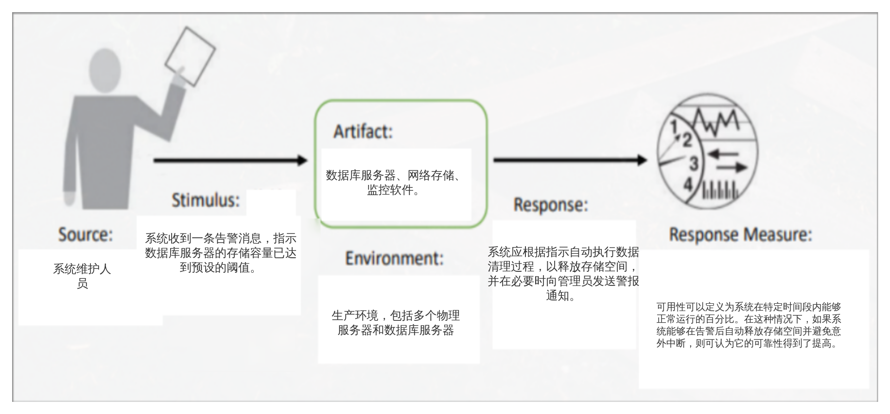
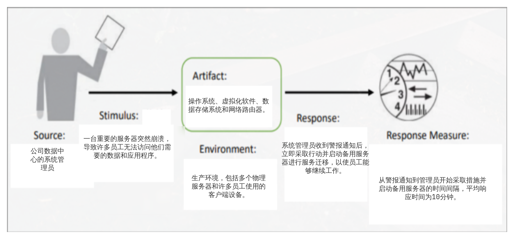
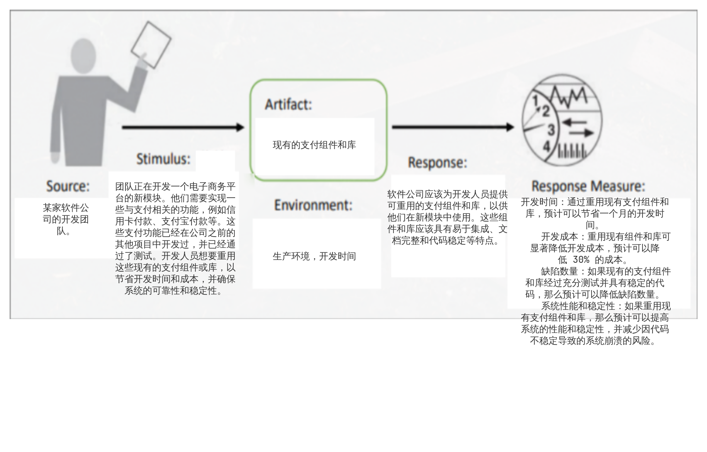
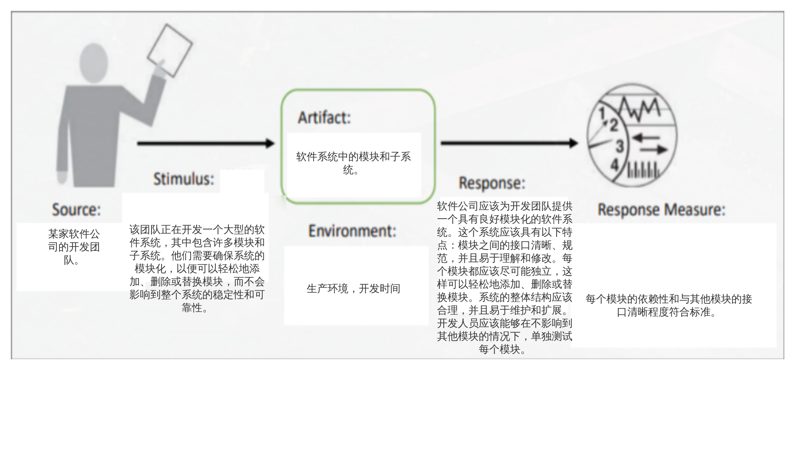

# Homework1

## Quality	Attribute	Scenarios

### 可靠性(Reliability)和可恢复性(Recoverability)

#### Reliability General Scenario

| Portion of Scenario | Possible Values                                              |
| ------------------- | ------------------------------------------------------------ |
| Source              | 系统开发人员、测试人员、维护人员或操作人员。                 |
| Stimulus            | 系统启动过程或响应外部事件、用户输入或错误条件。             |
| Artifact            | 处理刺激或响应的系统组件、模块或接口。                       |
| Environment         | 操作或测试环境，包括硬件、软件和网络组件。                   |
| Response            | 系统应正确地执行所需的功能，或在失败的同时以适当的错误消息通知。 |
| Response Measure    | 故障平均时间间隔、平均修复时间、可用性、可靠性、容错能力、平均失效时间等 |

#### Reliability Concrete Scenario

#### Recoverability General Scenario

| Portion of Scenario | Possible Values                                              |
| ------------------- | ------------------------------------------------------------ |
| Source              | 系统维护人员或操作人员                                       |
| Stimulus            | 系统出现了错误，如系统崩溃、应用程序故障或网络中断。         |
| Artifact            | 操作系统、应用程序、协议栈、错误日志。                       |
| Environment         | 生产环境，包括多个物理服务器和客户端设备。                   |
| Response            | 系统应能够尽可能快速地自动恢复，例如重新启动应用程序，重新连接网络或恢复崩溃的进程，并在必要时向管理员发送警报通知。 |
| Response Measure    | 平均恢复时间、平均失效时间、可用性、可靠性、容错能力         |

#### Recoverability Concrete Scenario

### 可重用性(Reusability)和模块化(Modularity)

#### Reusasbility General Scenario

| Portion of Scenario | Possible Values                                              |
| ------------------- | ------------------------------------------------------------ |
| Source              | 负责维护或扩展系统的开发人员或软件工程师。                   |
| Stimulus            | 开发人员需要重用现有的软件组件或库来提高开发效率、降低成本和改善系统的质量。 |
| Artifact            | 可重用的现有软件组件或库。                                   |
| Environment         | 开发或维护时间。                                             |
| Response            | 系统应该为开发人员提供一组可重用的软件组件，这些组件可以轻松地集成到他们自己的系统中。 |
| Response Measure    | 在开发或维护中节省的时间、减少开发成本、减少缺陷数量、改善系统质量、改善系统性能或提高系统灵活性。 |

#### Resusability Concrete Scenario

#### Modularity General Scenario

| Portion of Scenario | Possible Values                                              |
| ------------------- | ------------------------------------------------------------ |
| Source              | 系统开发人员、软件架构师或工程师。                           |
| Stimulus            | 系统开发人员需要创建一个易于开发、测试、维护和扩展的系统。他们还需要确保系统可以处理变化的需求或新功能。 |
| Artifact            | 代码模块、库、框架或其他软件组件。                           |
| Environment         | 软件生命周期的开发、测试和维护阶段。                         |
| Response            | 系统应该以模块化的方式设计，以便可以在不影响系统其他部分的情况下轻松修改或扩展系统。模块化还应该能够更有效地测试和维护系统。 |
| Response Measure    | 开发时间、代码复杂度、代码可重用性、易于维护性、系统可扩展性和可靠性。 |

#### Modularity Concrete Scenario

## Tactics

<table>
    <thead>
        <tr>
            <th rowspan='2'>Strategies</th>
            <th rowspan='2'>Tactics</th>
            <th colspan='4'>Impacts(1有利，0无关，-1不利）</th>
        </tr>
        <tr>
            <th>Reusability</th>
            <th>Modularity</th>
            <th>Recoverability</th>
            <th>Reliability</th>
        </tr>
    </thead>
    <tbody>
        <tr>
            <td rowspan="2">异常处理</td>
            <td>错误日志记录</td>
            <td>1</td>
            <td>0</td>
            <td>1</td>
            <td>1</td>
        </tr>
        <tr>
            <td>代码缓存</td>
            <td>0</td>
            <td>1</td>
            <td>1</td>
            <td>1</td>
        </tr>
        <tr>
            <td rowspan="2">自动化测试</td>
            <td>单元测试</td>
            <td>1</td>
            <td>1</td>
            <td>0</td>
            <td>1</td>
        </tr>
        <tr>
            <td>集成测试</td>
            <td>1</td>
            <td>1</td>
            <td>0</td>
            <td>1</td>
        </tr>
        <tr>
            <td rowspan="2">冗余备份</td>
            <td>数据库冗余</td>
            <td>-1</td>
            <td>0</td>
            <td>1</td>
            <td>1</td>
        </tr>
        <tr>
            <td>系统镜像备份</td>
            <td>-1</td>
            <td>1</td>
            <td>1</td>
            <td>1</td>
        </tr>
        <tr>
            <td rowspan="2">检测与恢复</td>
            <td>自动崩溃检测</td>
            <td>0</td>
            <td>1</td>
            <td>1</td>
            <td>1</td>
        </tr>
        <tr>
            <td>事务回滚</td>
            <td>1</td>
            <td>0</td>
            <td>1</td>
            <td>1</td>
        </tr>
        <tr>
            <td rowspan="2">模块化设计</td>
            <td>模块化设计</td>
            <td>1</td>
            <td>1</td>
            <td>0</td>
            <td>0</td>
        </tr>
        <tr>
            <td>设计模式应用</td>
            <td>1</td>
            <td>1</td>
            <td>0</td>
            <td>0</td>
        </tr>
        <tr>
            <td rowspan="2">分层架构</td>
            <td>应用层与业务逻辑层分离</td>
            <td>0</td>
            <td>1</td>
            <td>0</td>
            <td>1</td>
        </tr>
        <tr>
            <td>数据访问层与业务逻辑层分离</td>
            <td>0</td>
            <td>1</td>
            <td>0</td>
            <td>1</td>
        </tr>
    </tbody>
</table>

## Quality	Attribute	Debate

笔者认为，与Maintainability密切相关的质量属性有：可测试性、可理解性、可重用性和可扩展性。笔者的研究学习主要基于Radhakrishnan和Rajaraman的论文“Software Maintainability: Metrics and Practices”。

根据Radhakrishnan和Rajaraman在他们的论文“Software Maintainability: Metrics and Practices”中的观点，可维护性的质量属性包括可测试性、可理解性、可重用性和可扩展性。这些属性与可维护性密切相关。

可测试性指的是软件代码的易于测试程度。Radhakrishnan和Rajaraman认为，可测试性是软件可维护性的关键因素之一，因为它提供了检测和识别缺陷和问题的手段，这有助于提高软件的可维护性。他们还指出，高质量的测试用例可以提高代码的可读性和可维护性。

可理解性指的是软件代码的易于理解程度。Radhakrishnan和Rajaraman认为，可理解性是软件可维护性的关键因素之一，因为它可以提高软件工程师的代码理解能力，这有助于更快地识别和解决问题。

可重用性指的是软件代码的易于重用程度。Radhakrishnan和Rajaraman指出，可重用性可以降低软件代码的复杂度和维护成本，并提高代码质量和可维护性。他们还提到了设计模式和代码重构技术对于提高代码的可重用性和可维护性的重要性。

可扩展性指的是软件代码的易于扩展程度。Radhakrishnan和Rajaraman认为，可扩展性可以帮助软件工程师更容易地进行代码修改和增强，这可以提高代码的可维护性。他们还指出，面向对象编程范式和设计模式对于提高代码的可扩展性和可维护性也非常重要。

综上所述，可测试性、可理解性、可重用性和可扩展性都是与可维护性密切相关的质量属性。通过在软件开发过程中考虑和优化这些质量属性，可以提高软件的可维护性和可靠性。